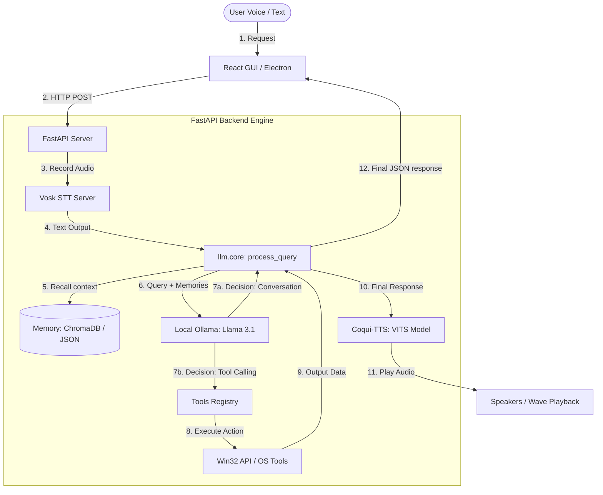

# Sofi AI Assistant

Sofi is a highly customizable, personalized, offline-capable AI companion and desktop automation assistant designed and developed for **Ilakkiyan**. Combining a modern frontend interface, a native desktop shell, and a robust Python backend service, Sofi integrates local LLM capabilities, high-performance offline Speech-to-Text (STT), natural Text-to-Speech (TTS), long-term semantic memory, and desktop control automation.

🎬 **Demo Video**: [Watch on LinkedIn](https://www.linkedin.com/posts/ilakkiyan-j_aiassistant-localai-ollama-ugcPost-7479490575767982080-camX/?utm_source=share&utm_medium=member_desktop&rcm=ACoAAEHRonUBc52UFbhgr9SKwmDdAV7xMsPCd2I)

---

## 🏗️ Architecture & Workflow

Sofi is built as a hybrid desktop application utilizing three key components:
1. **Frontend (React + Vite)**: A clean, modern chat interface that renders conversations, displays real-time typing indicators, and offers control toggles (such as voice mute/unmute).
2. **Desktop Shell (Electron)**: A desktop wrapper that hosts the React frontend and facilitates native window integration.
3. **Backend Service (FastAPI + Python)**: The engine of the assistant. It manages offline transcription, voice generation, chat history, semantic memories, and triggers local device tools.

### Visual Workflow Diagram

Below is the logical execution flow of the assistant when processing user queries:



A detailed flow diagram is also available in the repository at [Workflow/Workflow.png](file:///d:/Projects/Sofi%20-%20AI%20Assistant/Workflow/Workflow.png).

---

## 🌟 Core Features

- **🎙️ Responsive Offline Speech Recognition (STT)**: Uses the **Vosk** engine for continuous voice capture and local decoding, tuned for rapid transcription.
- **🔊 Expressive Offline Text-to-Speech (TTS)**: Powered by the **Coqui-TTS VITS** model for high-fidelity speech synthesis. Features pronunciation formatting (IPA phonemes) specifically tuned for the name *"Ilakkiyan"*.
- **🧠 Semantic Long-Term Memory**: Integrates memory recall capabilities storing user context and conversation history to personalize interactions over time.
- **⚙️ Windows Device Automation**: Native system controls exposed as LLM tools:
  - Adjust screen brightness and speaker volume (including muting).
  - Enable/disable WiFi and Bluetooth adapters.
  - Query hardware metrics (CPU, RAM, and Battery percentages).
  - Retrieve local drive storage and disk space metadata.
  - Empty the Windows Recycle Bin, capture screenshots, and manipulate the system clipboard.
  - Lock, restart, or shutdown the PC.
- **📂 File Manager & File Explorer**: Sandbox-based file creation, writing, appending, reading, and deletion within the user space, plus shortcut hooks to open standard directories (Downloads, Documents, Desktop, etc.).
- **🚀 Dynamic App Launcher**: System-wide Start Menu indexer and UWP app scanning. Supports fuzzy matching to launch (e.g., Chrome, Spotify, WhatsApp) or close desktop programs.
- **🔎 Enhanced Web Search**: Automated search orchestration (DDG, Bing, Brave, Google Lite, and YouTube) with intent classification and AI-driven summarization.

---

## 🛠️ Tech Stack

- **Frontend client**: React 19, Vite, React Icons
- **Desktop client**: Electron 39
- **Backend framework**: FastAPI, Uvicorn
- **Language Models**: Ollama (Llama 3.1 / 3.0)
- **Speech Processing**: Vosk (STT), Coqui-TTS (TTS), Sounddevice, Simpleaudio
- **Database/Memory**: ChromaDB, Sentence-Transformers (for semantic memory)
- **System Utilities**: Pycaw, PSUtil, Win32 API, FuzzyWuzzy

---

## 📋 Prerequisites

Ensure the following environments and applications are installed on your Windows machine:

1. **Python 3.10 or 3.11** (Note: Python 3.12+ might face installation issues with Coqui-TTS/Pycaw libraries).
2. **Node.js (v18+)** & **npm**.
3. **Ollama**: Download and install [Ollama](https://ollama.com). Pull the Llama model by running:
   ```bash
   ollama run llama3.1
   ```
4. **eSpeak NG**: Required by Coqui-TTS for phoneme processing.
   - Download the installer from the [eSpeak NG releases page](https://github.com/espeak-ng/espeak-ng/releases).
   - Install to the default location: `C:\Program Files\eSpeak NG\espeak-ng.exe`.
5. **Vosk Language Model**:
   - Download `vosk-model-en-us-0.22-lgraph` from [Vosk Models](https://alphacephei.com/vosk/models).
   - Extract it inside `backend/models/vosk-model-en-us-0.22-lgraph`.

## 🚀 Quick Start Guide (Run the Whole Application)

To start the complete **Sofi AI Operating System** (Ollama + Backend Server + React Frontend + Electron Desktop Shell), run the commands below in separate terminals:

### Step 1: Start the Local Ollama LLM Daemon
```powershell
ollama serve
```

### Step 2: Start the FastAPI Async Backend Server
```powershell
cd backend
.venv\Scripts\activate
python -m uvicorn server:app --host 127.0.0.1 --port 8000
```

### Step 3: Start the React Frontend Dev Server
```bash
cd frontend
npm run dev
```

### Step 4: Launch the Electron Desktop Application
```bash
cd electron
npx electron main.js
```

---

## ⚙️ Setup and Detailed Installation

### 1. Set Up the Backend
Navigate to the `backend` folder, set up a Python virtual environment, install the dependencies, and start the FastAPI service:

```powershell
# Navigate to backend
cd backend

# Create virtual environment
python -m venv .venv

# Activate virtual environment
.venv\Scripts\activate

# Install required python packages
pip install -r requirements.txt

# Run the FastAPI server
uvicorn server:app --reload
```
The backend server runs locally on `http://127.0.0.1:8000`.

### 2. Set Up the GUI Frontend & Electron
In another terminal, navigate to the `frontend` folder, install npm dependencies, and start the application:

```bash
# Navigate to frontend
cd frontend

# Install Node dependencies
npm install

# Start the Vite developer server + Electron Client
npm run dev
```

---

## 📦 Packaging and Distribution (.EXE)

To bundle Sofi into a standalone, single-executable Windows installer containing both the packaged React GUI and the compiled Python backend, execute the following commands:

### 1. Compile the Backend Executable
We use **PyInstaller** to compile the Python source code into a packaged bundle:
```powershell
cd backend
.venv\Scripts\pip install pyinstaller
.venv\Scripts\pyinstaller --noconfirm backend.spec
```
This builds and outputs the backend executable directory into `backend/dist/backend/`.

### 2. Build and Package the GUI
Navigate to the frontend folder, build the static Vite resources, and compile the final setup installer using **electron-builder**:
```bash
cd ../frontend

# Install packages
npm install

# Build production React assets
npm run build

# Package Electron app and link Python backend dist
npm run dist
```
This will compile the resources, wrap the compiled Python executable inside the extra resources, and generate the Windows installation file at:
`frontend/dist-package/Sofi Setup 1.0.0.exe`

---

## 🤝 Project Structure

```text
├── README.md                 # Project Overview & Guide
├── Workflow/                 # Flowcharts and graphics
│   ├── Workflow.png
│   └── Workflow.drawio
├── backend/                  # FastAPI Backend Service
│   ├── llm/                  # Prompt engineering, schemas, tool processors
│   ├── memory/               # Context recall/remember functions
│   ├── models/               # Directory containing STT models
│   ├── tools/                # App, device, file, and web tool functions
│   ├── server.py             # Main REST API application
│   ├── stt_vosk_server.py    # Speech-to-Text stream service
│   ├── tts_coqui.py          # Text-to-Speech audio service
│   └── requirements.txt      # Python dependencies
├── electron/                 # Electron main and preload wrappers
│   └── main.js
└── frontend/                 # React UI Web app
    ├── src/
    │   ├── components/       # Chat layouts, visual components
    │   ├── App.jsx           # Main controller
    │   └── main.jsx
    └── package.json          # Node dependencies and build scripts
```
